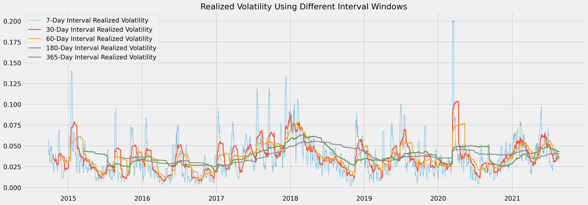
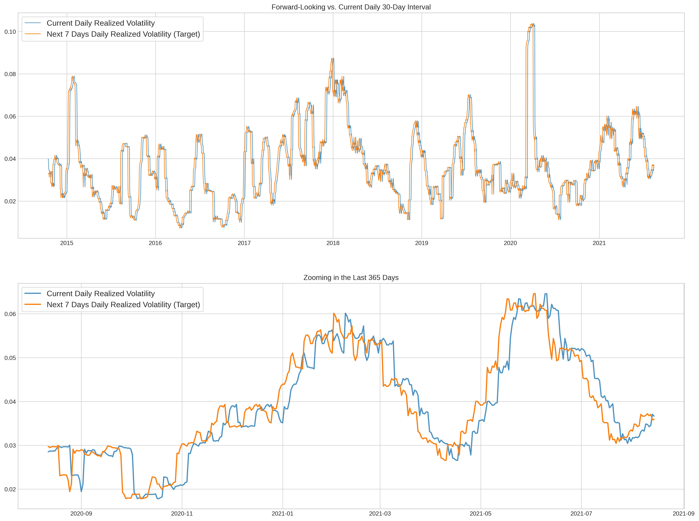
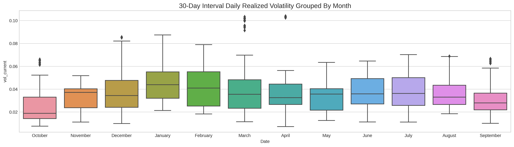
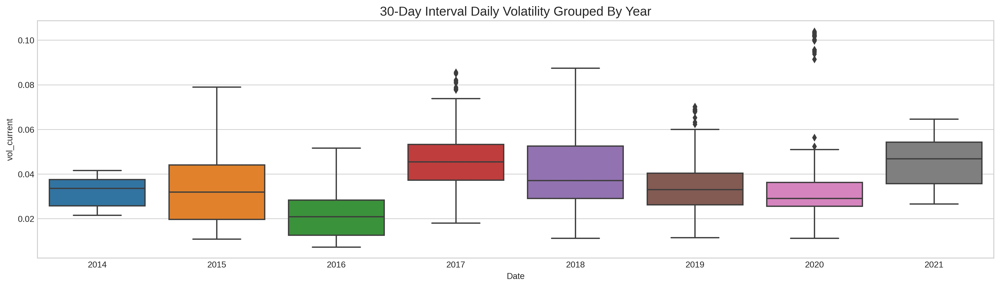
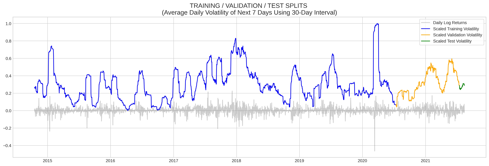
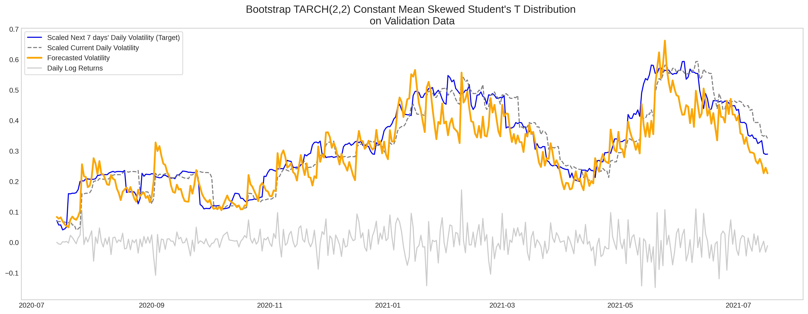
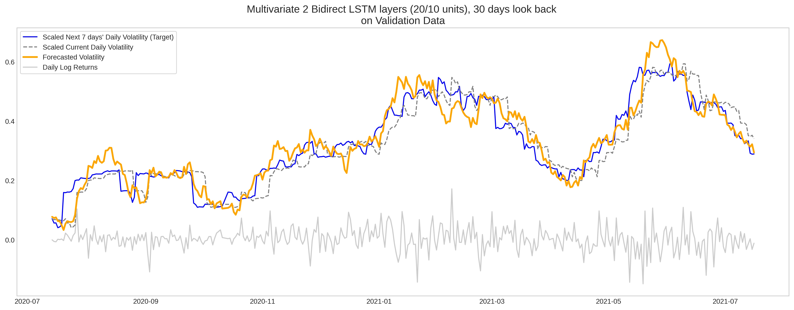
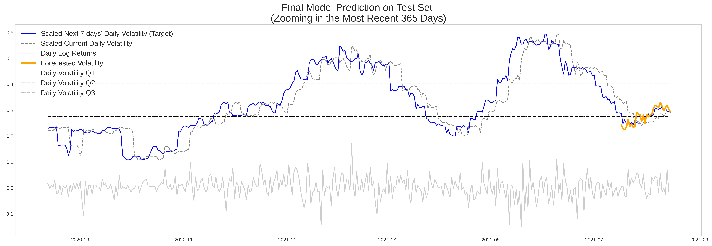

# Bitcoin's Realized Volatility Forecasting with GARCH and Multivariate LSTM

Author: **Chi Bui**

## This Repository

### Repository Directory
```
├── README.md                    <-- Main README file explaining the project's business case,
│                                    methodology, and findings
│
├── Notebooks                    <-- Jupyter Notebooks for exploration and presentation
│   └── Exploratory              <-- Unpolished exploratory data analysis (EDA) and modeling notebooks
│   └── Reports                  <-- Polished final notebooks
│       └── report-notebook    
│ 
│
├── performance_df               <-- records of all models' performance metrics & propability predictions 
│                                    on validation set
│
├── reports                      <-- Generated analysis
│   └── presentation.pdf         <-- Non-technical presentation slides
│ 
│
└── images                       <-- Generated graphics and figures to be used in reporting
```

### Quick Links
1. [Final Analysis Notebook](./Notebooks/Reports/report-notebook.ipynb)


## Overview

Volatility is generally accepted as the best measure of market risk and volatility forecasting is used in many different applications across the industry including risk management, value-at-risk, portfolio construction and optimisation, active fund management, risk-parity investing, and derivatives trading. 

Volatility attempts to measure magnitude of price movements that a financial instrument experiences over a certain period of time. The more dramatic the price swings are in that instrument, the higher the level of volatility, and vice versa.

The purpose of this project is to take a sneak peek into the future by **forecasting the next 7 days' average daily realized volatility of BTC-USD** using 2 different approaches - the traditional econometric approach to volatility prediction of financial time series **GARCH** and state-of-the-art **LSTM Neural Networks**.


## Business Problem

Since Bitcoin's first appearance in 2009, it has changed the world's financial landscape substantially. The decentralized cryptocurrency has established itself as an asset class recognized by many asset managers, large investment banks and hedge funds. As the speed of mainstream adoption continues to soar, it is also leading investors to explore a new venture, such as crypto options.

Bitcoin has been historically known to be more volatile than regulated stocks and commodities. Its most recent surge in late December 2020, early January 2021 has brought about a lot of questions and uncertainties about the future financial landscape. At the point of writing this report (August 2021), Bitcoin is traded at slightly above USD 50,200, which is no small feat considering it entered 2020 at around USD 7,200. 

Although the forecasting and modeling of volatility has been the focus of many empirical studies and theoretical investigations in academia, forecasting volatility accurately remains a crucial challenge for scholars. On top of that, since crypto option trading is relatively new, there has not been as much research done on this Bitcoin volatility forecasting. Crytocurrencies carry certain nuances that differ themselves from traditional regulated stocks and commodities, which would also need to be accounted for.


## Dataset

The historical dataset of Bitcoin Open/Close/High/Low prices were obtained using the Yahoo Finance API **`yfinance`**. This API is free, very easy to set up, but yet still contains a wide range of data and offerings. 

BTC-USD prices were downloaded using ticker `BTC-USD` at 1-day interval. Yahoo did not add Bitcoin until 2014; and therefore although it was first traded in 2009, **`yfinance`** only contains data from September 2014 until now (August 2021). I would therefore be working with over 2,500 datapoints covering about 7 years of trading days.

### Dataset Structure

The dataset contains daily prices of BTC-USD including:
- Open
- High
- Low
- Close

The objective of this project is to forecast the average daily volatility of BTC-USD 7 days out, using an Interval Window of 30 days. 


## Volatility Measuring 

Volatility does not measure the direction of price changes of a financial instrument, merely its dispersions over a certain period of time. The more dramatic the price swings are in that instrument, the higher the level of volatility, and vice versa. High volatility is associated with higher risk, and low volatility lower risk.

- **Historical Volatility** (HV) or **Realized Volatility** is the actual volatility demonstrated by the underlying over a period of time. Realized Volatility is commonly calculated as the standard deviation of price returns,
which is the dollar change in price as a percentage of previous day's price.
- **Implied volatility** (IV), on the other hand, is the level of volatility of the underlying that is implied by the current option price.

(The main focus of this project is **NOT Implied Volatility**, which can be derived from option pricing models such as the Black Scholes Model). 

Traditionally, Realized Volatility is defined as the **Standard Deviation of Daily Returns over a period of time**. Mathematically, **Daily Returns** can be represented as:


However, for practicality purposes, it's generally preferable to use the **Log Returns**, especially in mathematic modeling, because it helps eliminate non-stationary properties of time series data, and makes it more stable:

**Log Returns** Formula:

/begin{align*}
r_{t, t+i} = log(P_{t+i} / P_{t})
/end{align*}

(In both formulas, $P_{t}$ represents the price at time step $t$)

There's another advantage to log returns, which is that they're additive across time: 

/begin{align*}
r_{t1, t2} + r_{t2, t3} = r_{t1, t3}
/end{align*}

For this specific project, **DAILY REALIZED VOLATILITY** is calculated using an **interval window** of **30 days** as follows:

/begin{align*}
\sigma_{daily} = \sqrt{\sum_{t} r_{t-1, t}^2} * \sqrt{\frac{1}{interval-1}}$
/end{align*}

The reason I selected 30 days is because 7 days seems too noisy to observe meaningful patterns, while longer intervals seem to smooth the volatility line down significantly and tend to mean-revert. 

Using interval window of 30 days would also help avoid wasting too many datapoints at the beginning of the dataset.



### Forecasting Target

The target here would be `vol_future` which represents the daily realized volatility of the next `n_future` days from today (average daily volatility from `t + n_future - INTERVAL_WINDOW` to time step `t + n_future`). 

For example, using an `n_future` value of 7 and an `INTERVAL_WINDOW` of 30, the value that I want to predict at time step `t` would be the average daily realized volatility from time step `t-23` to time step `t+7`.




## Exploratory Data Analysis

### Daily Volatility Grouped by Month



### Daily Volatility Grouped by Year




## Train-Validation-Test Splits

There're a total of 2491 usable datapoints in this dataset which covers a period of almost 7 years from October 2014 until today (August 2021). Since cryptocurrencies are not traded on a regulated exchange, the Bitcoin market is open 24/7, 1 year covers a whole 365 trading days instead of 252 days a year like with other stocks and commodities.

I then split the dataset into 3 parts as follows:
- the most recent 30 usable datapoints would be used for final Testing - approx. 1.2%
- 1 full year (365 days) for Validation and model tuning during training - approx. 14.7%
- and the remaining for Training - approx. 84.1%

The final model would be trained on the combination of Training & Validation set, and then tested against the Test set (last 30 days with future volatility available for performance evaluation).




# Modeling

## Performance Metrics

Usually with financial time series, if we just shift through the historic data trying different methods, parameters and timescales, it's almost certain to find to some strategy with in-sample profitability at some point. However the whole purpose of "forecasting" is to predict the future based on currently available information, and a model that performs best on training data might not be the best when it comes to out-of-sample generalization (or **overfitting**). Avoiding/Minimizing overfitting is even more important in the constantly evolving financial markets where the stake is high.

The 2 main metrics I'd be using are **RMSPE (Root Mean Squared Percentage Error)** and **RMSE (Root Mean Square Errors)** with RMSPE prioritized. Timescaling plays a crucial role in the calculation of volatility due to the level of freedom in frequency/interval window selection. Therefore, RMSPE would help capture degree of errors compared to desired target values better than other metrics. In addition, RMSPE would punish large errors more than regular MAPE (Mean Absolute Percentage Error).

RMSE and RMSPE would be tracked across different models' performance on validation set forecasting to indicate their abilities to generalize on out-of-sample data.


## Baseline Models

Two different simple baseline models were created to compare later models against. These 2 simple models are based on 2 essential characteristics of volatility:
- **Mean Baseline model**: volatility in the long term will probably **mean revert** (meaning it'd be close to whatever the historical long-term average has been)
- **Naive Random Walk Forecasting**: volatility tomorrow will be close to what it is today (**clustering**) 


## GARCH Models

(Reference: http://users.metu.edu.tr/ozancan/ARCHGARCHTutorial.html)

GARCH stands for **Generalized Autoregressive Conditional Heteroskedasticity**, which is an extension of the ARCH model (Autoregressive Conditional Heteroskedasticity). 

GARCH includes lag variance terms with lag residual errors from a mean process, and is **the traditional econometric approach to volatility prediction of financial time series**.

Mathematically, GARCH can be represented as follows:

\begin{align*}
\sigma_{t}^2 = \omega + \sum_{i}^{q}\alpha_{i}\epsilon_{t-i}^2 + \sum_{1}^{p}\beta_{i}\sigma_{t-i}^2
\end{align*}

in which $\sigma_{t}^2$ is variance at time step `t` and $\epsilon_{t-i}^2$ is the model residuals at time step `t-1`

GARCH(1,1) only contains first-order lagged terms and the mathematic equation for it is: 

\begin{align*}
\sigma^2_t = \omega + \alpha\epsilon^{2}_{(t-1)} + \beta\sigma^{2}_{(t-1)}
\end{align*}

where $\alpha$, $\beta$ and $\omega$ sum up to 1, and $\omega$ is the long term variance.

---

(Reference: Sinclair (2020))

GARCH is generally regarded as an insightful improvement on naively assuming future volatility will be like the past, but also considered widely overrated as predictor by some experts in the field of volatility. GARCH models capture the essential characteristics of volatility: clustering and mean-revert.

Among all variants of the GARCH family that I have created, **TARCH(2,2)** with **Bootstrap** forecasting method was able to achive highest RMSPE and RMSE on the Validation Set.



## Neural Networks

While GARCH remains the gold standard for volatility prediction within traditional financial institutions, there has been an increasing numbers of professionals and researchers turning to Machine Learning, especially Neural Networks, to gain insights into the financial markets in recent years.

### Univariate Bidirectional LSTM

**Bidirectional LSTM** is an extension of the regular LSTM. Since all timesteps of the input sequence are already available, Bidirectional LSTM could train 2 instead of 1 LSTMs on the same input sequence:
- 1st one on the inputs as-is
- 2nd one on the reversed copy of the inputs

This could help provide additional context to the networks, and usually produces faster and fuller learning on the problem.

After experimenting with various Neural Networks architectures, I found that a simple 2-layered Bidirectional LSTM model with 32 and 16 units outpeformed everything else, including the best GARCH model found. 




## Final Model

### Multivariate LSTM

For financial data, using only 1-dimensional data is likely insufficient. That could be the reason why most of the above models failed to yield better result than Naive Forecasting. It doesn't matter how many neurons or hidden layers are used, or how complex the model's architectures are, inadequate data is not going to produce the best results. Therefore, I decided to create another set of LSTM models but multivariate (meaning they can process other features other than the volatility itself).

### Feature Engineering

The Open/High/Low/Close prices are usually very similar and highly correlated to each other. Therefore, instead of keeping all of them in the dataset, I would add 2 more features:
- **High-Low Spread** - which is the logarithm of the difference between the Highest and Lowest prices intraday as a percentage of the Closing price
- **Open-Close Spread** - which is the difference between the Close and Open prices intraday as a percentage of the Closing price

- and then take the logarithm of the Volume column

and eliminate the three `Close`, `Open`, `High`, `Low` columns.

The predict here would be to predict next 7 days' volatility (`vol_future`) column using 4 below variables of the last `n_past` days:
1. `HL_sprd`
2. `CO_sprd`
3. `Volume`
4. `vol_current`

**Reshaping the inputs** is literally the meat of Multivariate LSTM. Inputs for LSTM should have the following shape:

**`[batch_size, n_past, input_dims]`**

in which:

- **`batch_size`** is the number of datapoints in each batch
- **`n_past`** is the number of past time steps to be used for prediction 
- **`input_dims`** is the number of input features (which is 4 in this case)  

### Final Model Architecture

The best performing Multivariate model is as simple 2-layered Bidirectional LSTM with 20 and 10 units using a lookback window `n_past` of 30 days.




# Conclusion

|    | Model                                                                    |   Validation RMSPE |   Validation RMSE |
|---:|:-------------------------------------------------------------------------|-------------------:|------------------:|
|  0 | Mean Baseline                                                            |           0.812957 |         0.136064  |
|  1 | Random Walk Naive Forecasting                                            |           0.233755 |         0.0525863 |
|  2 | GARCH(1,1) | Constant Mean | Normal Dist                                 |           0.534194 |         0.185466  |
|  3 | Analytical GJR-GARCH(1,1,1) | Constant Mean | Skewt Dist                 |           0.286386 |         0.0910722 |
|  4 | Bootstrap TARCH(1,1) | Constant Mean | Skewt Dist                        |           0.217488 |         0.0696523 |
|  5 | Simulation TARCH(1,1) | Constant Mean | Skewt Dist                       |           0.222418 |         0.0731703 |
|  6 | Bootstrap TARCH(2,2) | Constant Mean | Skewt Dist                        |           0.213242 |         0.0668474 |
|  7 | Simple LR Fully Connected NN | n_past=14                                 |           0.252272 |         0.0526278 |
|  8 | LSTM 1 layer 20 units | n_past=14                                        |           0.234317 |         0.0511795 |
|  9 | 2 layers Bidirect LSTM (32/16 units) | n_past=30                         |           0.200845 |         0.0485337 |
| 10 | 1 Conv1D 2 Bidirect LSTM layers (32/16) | n_past=60 | batch=64           |           0.27029  |         0.0605635 |
| 11 | 2 Bidirect LSTMs (32/16) | n_past=30 | batch=64 | SGD lr=5e-05           |           0.761351 |         0.141783  |
| 12 | Multivariate Bidirect LSTM 1 layer (20 units) | n_past=30                |           0.191266 |         0.0482642 |
| 13 | Multivariate Bidirect LSTM 3 layers (64/32/16 units) | n_past=30         |           0.236086 |         0.0551671 |
| 14 | Multivariate 2 Bidirect LSTM layers (20/10 units) | n_past=30 | batch=64 |           0.191254 |         0.0487875 |

A trader does not need to make perfectly accurate forecast to have a positive expectation when participating in the markets, he/she just needs to make a forecast that is **more correct than the consensus**, which I believe my best model so far would be able to help achieve. 

My final LSTM model has an RMSPE of 0.0708 on the Test set (which is the most recent 30 days of which future volatility data is available for comparison). Since RMSPE indicates the average magnitude of the error in relation to the actual values, that translates to **a magnitude accuracy of 93% on the average 7 days forward-looking daily volatility forecasting within the period of 07/17/2021 to 08/15/2021**, which is part of some more quiet months for volatility historically.  

In terms of performance on the validation set (365 days of data), LSTM model has an RMSPE of 0.191254, which is **roughly 2.1% better than the best performing variant of the GARCH models** - TARCH(2,2) with an RMSPE of 0.213242.

However, since financial time series data are constantly evolving, no model would be able to consistently forecast with high accuracy level forever. The average lifetime of a model is between 6 months to 5 years, and there's a phenomenon in quant trading that is called **alpha decay**, which is the loss in predictive power of an alpha model over time. In addition, researchers have proved that the publication of a new "edge" or anomaly in the markets lessens its returns by up to 58%. 

These models therfore require constant tweaking and tuning based on the most recent information available to make sure the model stays up-to-date and learn to evolve with the markets. 


# Next Steps

As briefly mentioned above, I think there's potential application of WaveNet in the forecasting of volatility, and would like to explore that option in the future.

In addition, it's common knowledge that economic events could affect markets' dynamics. Since cryptocurrencies have cerain nuances that are different from other stocks and commodities', adding in regular economic calendars' events might not be the most relevant. I am currently still doing more research on the types of events that could have driven Bitcoin movements, and would like to incorporate that in another set of Multivariate LSTM models in the future to hopefully improve predictive power even more.

Another goal of mine is to extend the forecasting horizon to 30 days instead of 7. 30-day-out predictions would be able to bring a lot of values to option trading, as options contract cycles are usually expressed in terms of months. 


