# Bitcoin Realized Volatility Forecasting with GARCH and Multivariate LSTM

Author: **Chi Bui**

## This Repository

### Repository Directory
```
├── README.md                    <-- Main README file explaining the project's business case,
│                                    methodology, and findings
│
├── Notebooks                    <-- Jupyter Notebooks for exploration and presentation
│   └── Exploratory              <-- Unpolished exploratory data analysis (EDA) and modeling notebooks
│   └── Reports                  <-- Polished final notebooks
│       └── report-notebook    
│ 
│
├── performance_df               <-- records of all models' performance metrics & propability predictions 
│                                    on validation set
│
├── Report                       <-- Generated analysis
│   └── presentation.pdf         <-- Non-technical presentation slides
│ 
│
└── images                       <-- Generated graphics and figures to be used in reporting
```

### Quick Links
1. [Final Analysis Notebook](./Notebooks/Reports/report_notebook.ipynb)
1. [Non-Technical Presentation Slides](./Report/presentation.pdf)

### Remarks

The second part of the notebook utilizes LSTM, which uses an optimized implementation when running on a GPU. It's therefore highly recommended to run the notebooks on [Google Colab](https://colab.research.google.com/notebooks/intro.ipynb#recent=true).


## Overview

Since Bitcoin's first appearance in 2009, it has changed the world's financial landscape substantially. The decentralized cryptocurrency has established itself as an asset class recognized by many asset managers, large investment banks and hedge funds. As the speed of mainstream adoption continues to soar, it is also leading investors to explore new ventures, such as crypto options and futures.

Bitcoin has been historically known to be more volatile than regulated stocks and commodities. Its most recent surge in late December 2020, early January 2021 has brought about a lot of questions and uncertainties about the future financial landscape. At the point of writing this report (end of August 2021), Bitcoin is traded at slightly below USD 50,000, which is no small feat considering it entered 2020 at around USD 7,200. 

The purpose of this project is to take a sneak peek into the future by **forecasting the next 7 days' average daily Realized Volatility (RV) of BTC-USD** using 2 different approaches - the traditional econometric approach to volatility prediction of financial time series **GARCH** and state-of-the-art **LSTM Neural Networks**.


## Business Problem

Volatility attempts to measure magnitude of price movements that a financial instrument experiences over a certain period of time. The more dramatic the price swings are in that instrument, the higher the level of volatility, and vice versa.

Volatility is generally accepted as the best measure of market risk and volatility forecasting is used in many different applications across the industry. **Realized Volatility Forecasting** models are typically utilized in risk management, market making, portfolio optimization, and option trading. Specifically, according to Sinclair (2020), a number of trading strategies revolve around identifying situations where this volatility mismatch occurs:


in which Vega is the measurement of an option's price sensitivity to changes in the volatility of the underlying asset, and  is volatility.
As Implied Volatility (IV) could be derived from Option Prices using models such as the Black Scholes Model, forecasting Realized Volatility would give us the key to the second part of the equation.

Although the forecasting and modeling of volatility has been the focus of many empirical studies and theoretical investigations in academia, forecasting volatility accurately remains a crucial challenge for scholars. On top of that, since crypto option trading is relatively new, there has not been as much research done on this Bitcoin volatility forecasting. In addition, crytocurrencies carry certain nuances that differ themselves from traditional regulated stocks and commodities, which would also need to be accounted for.


## Dataset

The historical dataset of Bitcoin Open/Close/High/Low prices were obtained using the Yahoo Finance API **`yfinance`**. This API is free, very easy to set up, but yet still contains a wide range of data and offerings. 

I will be downloading BTC-USD prices using ticker `BTC-USD` at 1-day interval. Yahoo did not add Bitcoin until 2014; and therefore although it was first traded in 2009, **`yfinance`** only contains data from September 2014 until now (August 2021). I would therefore be working with approx. 2,500 datapoints covering about 7 years of trading days.


### Dataset Structure

The dataset contains daily prices of BTC-USD including:
- `Open`
- `High`
- `Low`
- `Close`

The objective of this project is to forecast the average daily **Realized Volatility** of BTC-USD 7 days out, using an Interval Window of 30 days. 

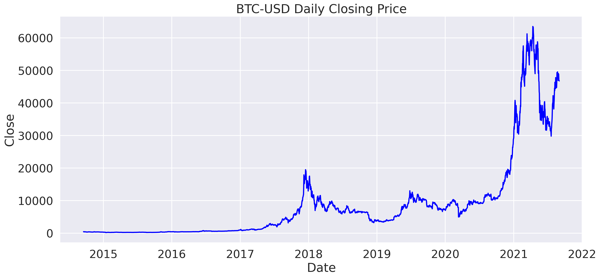


## Volatility Measuring 

Volatility does **not** measure the direction of price changes of a financial instrument, merely its dispersions over a certain period of time. High volatility is associated with higher risk, and low volatility lower risk. There're 2 main types of Volatility:

- **Historical Volatility** or **Realized Volatility** (RV) is the actual volatility demonstrated by the underlying asset over a period of time. Realized Volatility is commonly calculated as the standard deviation of price returns, which is the dollar change in price as a percentage of previous day's price.
- **Implied volatility** (IV), on the other hand, is the level of volatility of the underlying that is implied by the current option price.

(The main focus of this project is **NOT Implied Volatility**, which can be derived from option pricing models such as the Black Scholes Model). 

Traditionally, Realized Volatility is defined as the **Standard Deviation of Daily Returns over a period of time**. Mathematically, **Daily Returns** can be represented as:


However, for practicality purposes, it's generally preferable to use the **Log Returns**, especially in mathematic modeling, because it helps eliminate non-stationary properties of time series data, and makes it more stable:

**Log Returns** Formula:


(In both formulas,  represents the price at time step )

There's another advantage to log returns, which is that they're additive across time: 


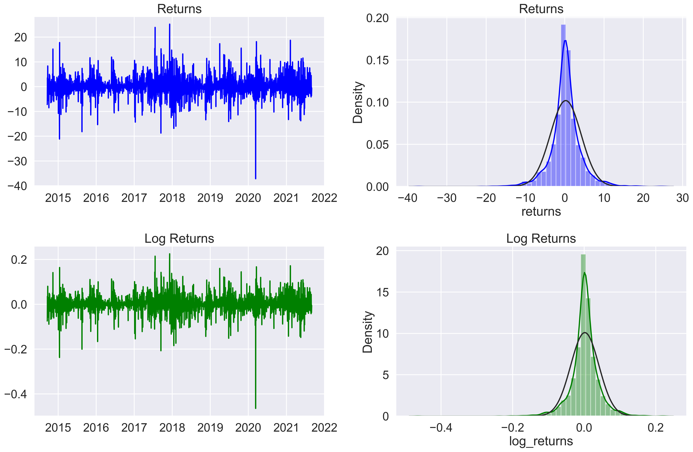

For this specific project, **DAILY REALIZED VOLATILITY** is calculated using an **interval window** of **30 days** as follows:


The reason I selected 30 days is because 7 days seems too noisy to observe meaningful patterns, while longer intervals seem to smooth the volatility down significantly and tend to revert back to the mean.

Using interval window of 30 days would also help avoid wasting too many datapoints at the beginning of the dataset.

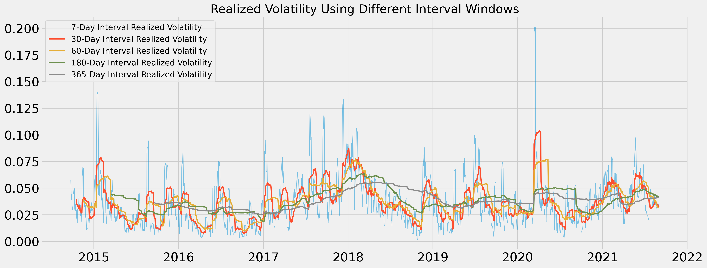

Time-series forecasting models are the models that are capable to predict **future** values based on previously observed values. Target "**future**" data in this case is obtained by **shifting the current volatility backward** by the number of `n_future` lags. 

For example, respected to last week's Monday, this week's Monday is the "**future**"; therefore I just need to shift the volatility this week back by 7 days, and use it as the desired "**future**" output for last week's, which I would then use for Neural Networks training and model performance evaluation. 

This is a visualization of how current volatility is shifted backward to become future values, which I want to eventually aim for.

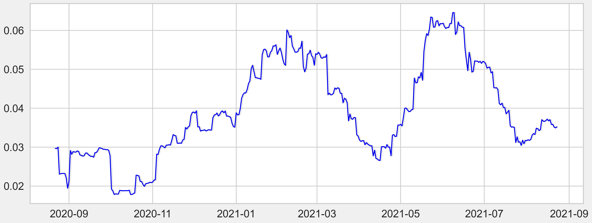

In the plot above, the **blue line** indicates the **target future** value that I ultimately try to match up to. 
And the dotted **gray line** represents the **current volatility** at that time step. 

### Forecasting Target

The target here would be `vol_future` which represents the daily realized volatility of the next `n_future` days from today (average daily volatility from `t + n_future - INTERVAL_WINDOW + 1` to time step `t + n_future`). 

For example, using an `n_future` value of 7 and an `INTERVAL_WINDOW` of 30, the value that I want to predict at time step `t` would be the average daily realized volatility from time step `t-22` to time step `t+7`.


## Exploratory Data Analysis

### Daily Volatility Grouped by Month

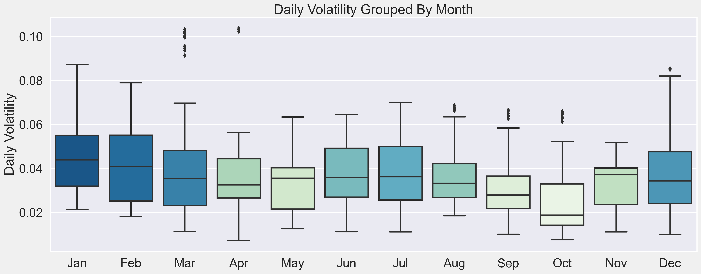

It can be observed that:
- volatility has consistently reached some of its higher points in the in the months of December/January historically 
- March and April have the most amount of large outliers 
- while August and September (which are the upcoming months of the final testing forecast) historically has been relatively quiet

### Daily Volatility Grouped by Year

Cryptocurrencies have gone through some huge structural changes in the last few years that would've affected volatility directly, such as:
- Crypto Options became available on Deribit in 2016
- Bitcoin Futures was offered on CME in 2017
- and then CME Bitcoin Options in 2020

These events have allowed people to trade crypto volatility more efficiently, and therefore data pre-2016 are likely structurally different, and probably followed different patterns compared to data after 2016.

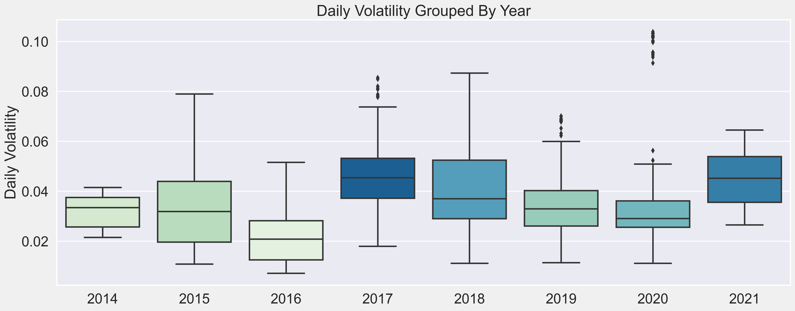

These events are reflected in the plot above - Bitcoin's first record peak in 2017 (around USD 19,800 towards the end of December). And the outliers in 2020 corresponded with its over 200% surge in 2020 (Bitcoin started at USD 7,200 at the beginning of 2020). It reached USD 20,000 on most exchanges on 12/15/2020, and then proceeded to hit USD 30,000 just 17 days later, which is no small feat. To put things in perspective, it took the Dow Jones close to 3 years to make the same move. And then, on 01/07/2021 it broke USD 40,000. As of the time this report is written, BTC-USD is traded at high USD 49,700.

It can be observed that 2021's daily volatiliy overall has also been on the higher side. 

### Volatility Distribution

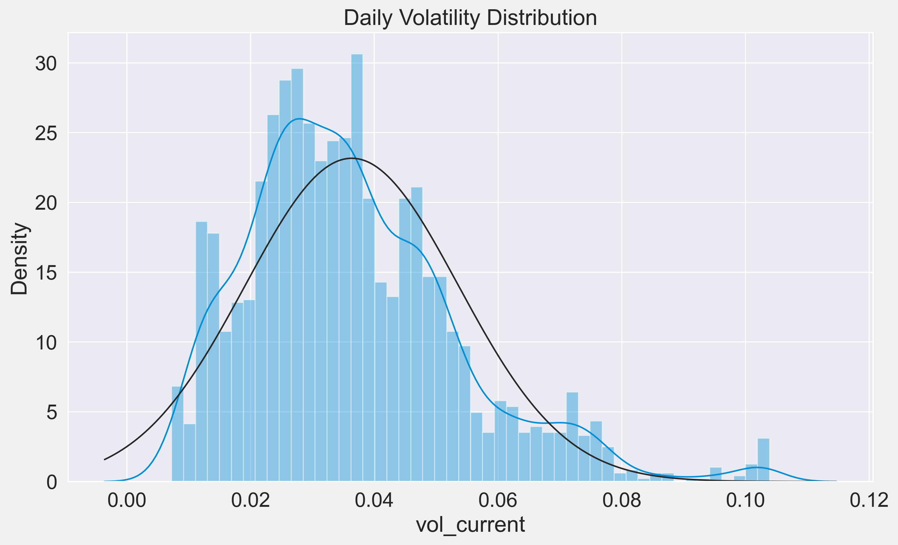

The distribution of daily realized volatility is lightly right skewed, with a small number of larger values spreaded thinly on the right.

A skewed right distribution would have smaller median compared to mean, and mode smaller than median (mode < median < mean).


## **Train-Validation-Test Splits**

There're a total of 2500 usable datapoints in this dataset which covers a period of almost 7 years from October 2014 until today (end of August 2021). Since cryptocurrencies are not traded on a regulated exchange, the Bitcoin market is open 24/7, 1 year covers a whole 365 trading days instead of 252 days a year like with other stocks and commodities.

I would split the dataset into 3 parts as follows:
- the most recent 30 usable datapoints would be used for **Final Model Testing - approx. 1.2%**
- 1 full year (365 days) for **Validation and Model Tuning during training - approx. 14.7%**
- and the remaining for **Training - approx. 84.1%**

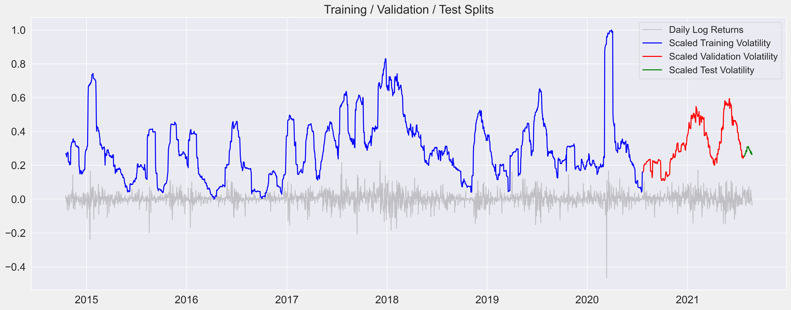


# Modeling

## Performance Metrics

Usually with financial time series, if we just shift through the historic data trying different methods, parameters and timescales, it's almost certain to find to some strategy with in-sample profitability at some point. However the whole purpose of "forecasting" is to predict the future based on currently available information, and a model that performs best on training data might not be the best when it comes to out-of-sample generalization (or **overfitting**). Avoiding/Minimizing overfitting is even more important in the constantly evolving financial markets where the stake is high.

The 2 main metrics I'd be using are **RMSPE (Root Mean Squared Percentage Error)** and **RMSE (Root Mean Square Errors)** with RMSPE prioritized. Timescaling plays a crucial role in the calculation of volatility due to the level of freedom in frequency/interval window selection. Therefore, RMSPE would help capture degree of errors compared to desired target values better than other metrics. In addition, RMSPE would punish large errors more than regular MAPE (Mean Absolute Percentage Error). 

RMSE and RMSPE would be tracked across different models' performance on validation set forecasting to indicate their abilities to generalize on out-of-sample data. As both of these metrics indicate the level of Error, the goal is to gradually reduce their values through different model structures and iterations.


## Baseline Models

Two different simple baseline models were created to compare later models against. These 2 simple models are based on 2 essential characteristics of volatility:
- **Mean Baseline model**: volatility in the long term will probably **mean revert** (meaning it'd be close to whatever the historical long-term average has been)

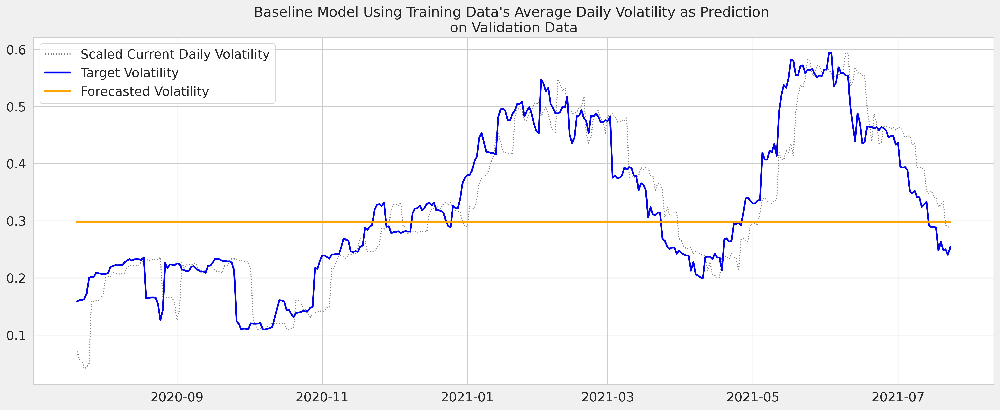

- **Naive Random Walk Forecasting**: volatility tomorrow will be close to what it is today (**clustering**) 

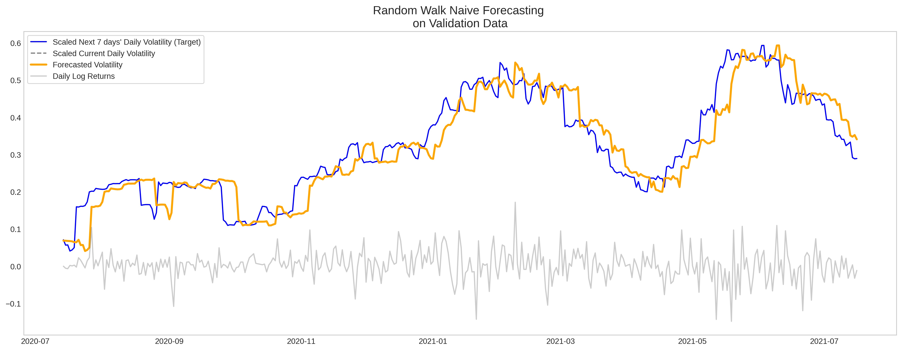


## GARCH Models

(Reference: http://users.metu.edu.tr/ozancan/ARCHGARCHTutorial.html)

GARCH stands for **Generalized Autoregressive Conditional Heteroskedasticity**, which is an extension of the ARCH model (Autoregressive Conditional Heteroskedasticity). 

GARCH includes lag variance terms with lag residual errors from a mean process, and is **the traditional econometric approach to volatility prediction of financial time series**.

Mathematically, GARCH can be represented as follows:


in which  is variance at time step  and  is the model residuals at time step 

GARCH(1,1) only contains first-order lagged terms and the mathematic equation for it is: 


where ,  and  sum up to 1, and  is the long term variance.

(Reference: Sinclair (2020))

GARCH is generally regarded as an insightful improvement on naively assuming future volatility will be like the past, but also considered widely overrated as predictor by some experts in the field of volatility. GARCH models capture the essential characteristics of volatility: clustering and mean-revert.

Among all variants of the GARCH family that I have created, **TARCH(1,2)** with **Bootstrap** forecasting method was able to achive lowest RMSPE and RMSE on the Validation Set.

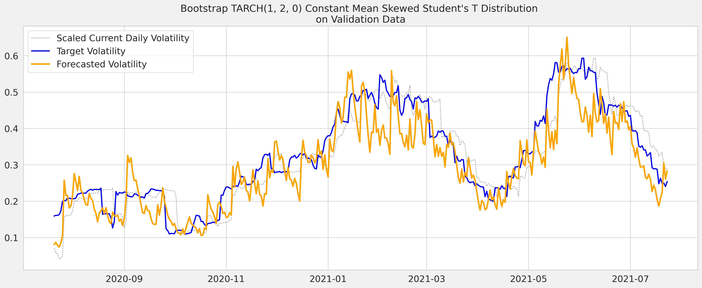


## Neural Networks

While GARCH remains the gold standard for volatility prediction within traditional financial institutions, there has been an increasing numbers of professionals and researchers turning to Machine Learning, especially Neural Networks, to gain insights into the financial markets in recent years.

### Univariate Bidirectional LSTM

**Bidirectional LSTM** is an extension of the regular LSTM. Since all timesteps of the input sequence are already available, Bidirectional LSTM could train 2 instead of 1 LSTMs on the same input sequence:
- 1st one on the inputs as-is
- 2nd one on the reversed copy of the inputs

This could help provide additional context to the networks, and usually produces faster and fuller learning on the problem.

After experimenting with various Neural Networks architectures, I found that a simple 2-layered Bidirectional LSTM model with 32 and 16 units outpeformed everything else, including the best GARCH model found. 

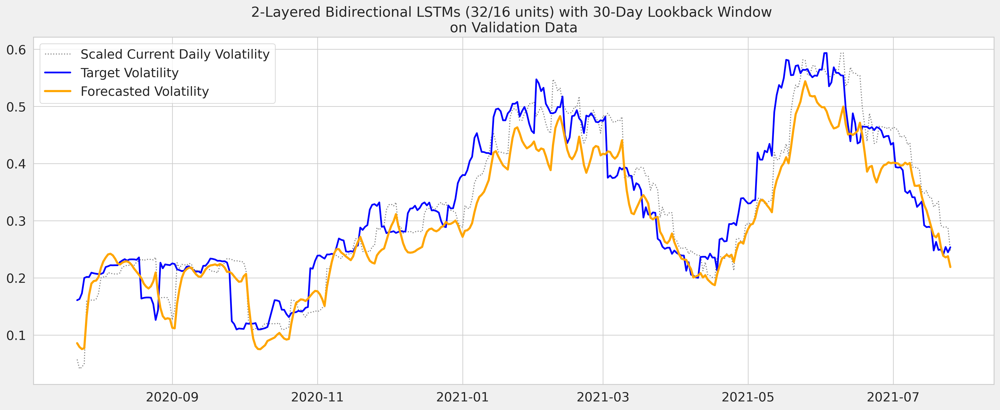


## Final Model

### Multivariate LSTM

For financial data, using only 1-dimensional data is likely insufficient. That could be the reason why most of the above models failed to yield better result than Naive Forecasting. It doesn't matter how many neurons or hidden layers are used, or how complex the model's architectures are, inadequate data is not going to produce the best results. Therefore, I decided to create another set of LSTM models but multivariate (meaning they can process other features other than the volatility itself).

### Feature Engineering

The Open/High/Low/Close prices are usually very similar and highly correlated to each other. Therefore, instead of keeping all of them in the dataset, I would add 2 more features:
- **High-Low Spread** - which is the logarithm of the difference between the Highest and Lowest prices intraday as a percentage of the Closing price
- **Open-Close Spread** - which is the difference between the Close and Open prices intraday as a percentage of the Closing price

- and then take the logarithm of the Volume column

and eliminate the three `Close`, `Open`, `High`, `Low` columns.

The predict here would be to predict next 7 days' volatility (`vol_future`) column using 4 below variables of the last `n_past` days:
1. `HL_sprd`
2. `CO_sprd`
3. `Volume`
4. `vol_current`

**Reshaping the inputs** is literally the meat of Multivariate LSTM. Inputs for LSTM should have the following shape:

**`[batch_size, n_past, input_dims]`**

in which:

- **`batch_size`** is the number of datapoints in each batch
- **`n_past`** is the number of past time steps to be used for prediction 
- **`input_dims`** is the number of input features (which is 4 in this case)  


### Final Model Architecture

The best performing Multivariate model is as simple 2-layered Bidirectional LSTMs with 32 and 16 units using a lookback window `n_past` of 30 days and `batch_size = 64`. In addition, there're 2 Dropout layers at 0.1 in following each hidden LSTM layers.

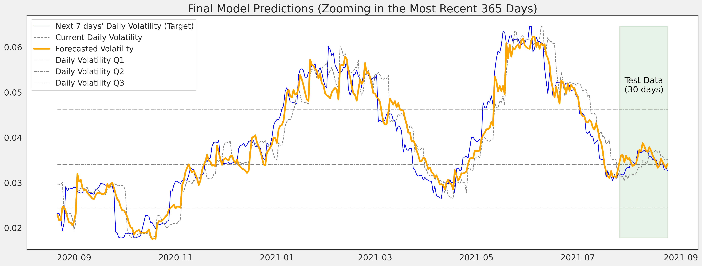

It should be stressed that the model was trained on both the training and validation data this time. Therefore it'd naturally trace the target more closely up until the third week of July 2021 where the validation ends. 


# Conclusion

|    | Model                                                                         |   Validation RMSPE |   Validation RMSE |
|---:|:------------------------------------------------------------------------------|-------------------:|------------------:|
| 12 | Multivariate Bidirect LSTM 2 layers (32/16 units), n_past=30                  |           0.156677 |         0.0461386 |
| 15 | Multivariate 2 Bidirect LSTM layers (32/16 units), n_past=30, batch=32, tanh  |           0.163605 |         0.0507814 |
| 13 | Multivariate Bidirect LSTM 3 layers (64/32/16 units), n_past=30               |           0.164623 |         0.0446602 |
| 14 | Multivariate 4 Bidirect LSTM layers (128/64/32/16 units), n_past=30, batch=64 |           0.167586 |         0.0503861 |
|  6 | Bootstrap TARCH(1, 2, 0), Constant Mean, Skewt Dist                           |           0.200954 |         0.0668514 |
|  9 | 2 layers Bidirect LSTM (32/16 units), n_past=30                               |           0.202388 |         0.0578647 |
|  4 | Bootstrap TARCH(1,1), Constant Mean, Skewt Dist                               |           0.209654 |         0.0698137 |
|  5 | Simulation TARCH(1,1), Constant Mean, Skewt Dist                              |           0.215751 |         0.0732927 |
|  8 | LSTM 1 layer 20 units, n_past=14                                              |           0.223199 |         0.0576027 |
|  1 | Random Walk Naive Forecasting                                                 |           0.224657 |         0.0525334 |
| 10 | 1 Conv1D 2 Bidirect LSTM layers (32/16), n_past=30, batch=64                  |           0.230372 |         0.0621463 |
|  7 | Simple LR Fully Connected NN, n_past=14                                       |           0.238177 |         0.0553356 |
|  3 | Analytical GJR-GARCH(1,1,1), Constant Mean, Skewt Dist                        |           0.276679 |         0.0903115 |
| 11 | 2 Bidirect LSTMs (32/16), n_past=30, batch=64, SGD lr=6.9e-05                 |           0.399735 |         0.1655    |
|  0 | Mean Baseline                                                                 |           0.50704  |         0.132201  |
|  2 | GARCH(1,1), Constant Mean, Normal Dist                                        |           0.530965 |         0.185607  |


In terms of performance on the validation set (7/23/2020 to 7/25/2021), my final LSTM model has an RMSPE of 0.156677, which is roughly 4.42% better than the best performing variant of the GARCH models found - TARCH(1,2) with an RMSPE of 0.200954. Traders do not need to make perfectly accurate forecast to have a positive expectation when participating in the markets, he/she just needs to make a forecast that is **both correct and more correct than the general consensus**. With GARCH still being the most popular volatility forecasting model, Multivariate LSTM could potentially give investors an advantage in terms of higher forecasting accuracy.

The final LSTM model has an RMSPE of 0.0534 on the Test set (which is the most recent 30 days of which future volatility data is available for comparison). Since RMSPE indicates the average magnitude of the error in relation to the actual values, an RMSPE of 0.0534 would translate to a magnitude accuracy of 94.65% on the average 7-day horizon daily volatility forecasting within the period of 07/26/2021 to 08/24/2021.  

However, since financial time series data are constantly evolving, no model would be able to consistently forecast with high accuracy level forever. The average lifetime of a model is between 6 months to 5 years, and there's a phenomenon in quant trading that is called **alpha decay**, which is the loss in predictive power of an alpha model over time. In addition, according to Sinclair (2020), researchers have found that the publication of a new "edge" or anomaly in the markets lessens its returns by up to 58%.  

These models therfore require constant tweaking and tuning based on the most recent information available to make sure they stay up-to-date and learn to evolve with the markets. 


# **Next Steps**

As briefly mentioned above, I think there's potential application of WaveNet in the forecasting of volatility, and would like to explore that option in the future.

In addition, it's common knowledge that economic events could affect markets' dynamics. Since cryptocurrencies have cerain nuances that are different from other stocks and commodities', incorporating the regular economic calendars' events might not be the most relevant. I am currently still doing more research on collecting significant events that could have driven Bitcoin movements, and would like to incorporate that in another Multivariate LSTM set of models in the future to hopefully improve predictive power even more.

Eventually I want to experiment with higher frequencies (ie. intra-day), and also different bucketing intervals as well.


# References:

1. Géron, A. (2019). *In Hands-on machine learning with Scikit-Learn & TensorFlow: concepts, tools, and techniques to build intelligent systems.* O'Reilly Media, Inc.

2. Sinclair, E. (2020). *Positional option trading: An advanced guide.* John Wiley &amp; Sons. 

3. https://algotrading101.com/learn/yfinance-guide/ 

4. https://www.coursera.org/learn/tensorflow-sequences-time-series-and-prediction/supplement/DM4fi/convolutional-neural-networks-course

5. https://insights.deribit.com/options-course/

6. https://arch.readthedocs.io/en/latest/univariate/univariate_volatility_forecasting.html 

7. https://www.investopedia.com/terms/v/vix.asp 

8. https://www.hindawi.com/journals/complexity/2021/6647534/ 

9. https://github.com/ritvikmath/Time-Series-Analysis/blob/master/GARCH%20Stock%20Modeling.ipynb

10. https://github.com/ritvikmath/Time-Series-Analysis/blob/master/GARCH%20Model.ipynb

11. https://www.kaggle.com/c/optiver-realized-volatility-prediction 

12. https://www.youtube.com/watch?v=NKHQiN-08S8

13. https://goldinlocks.github.io/ARCH_GARCH-Volatility-Forecasting/ 

14. https://towardsdatascience.com/time-series-analysis-on-multivariate-data-in-tensorflow-2f0591088502 

15. https://deepmind.com/blog/article/wavenet-generative-model-raw-audio 

16. https://github.com/philipperemy/keras-tcn 

17. http://users.metu.edu.tr/ozancan/ARCHGARCHTutorial.html

18. https://towardsdatascience.com/8-commonly-used-pandas-display-options-you-should-know-a832365efa95


